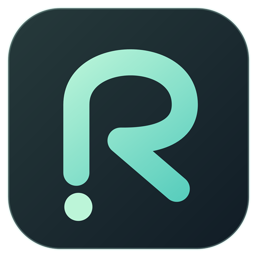
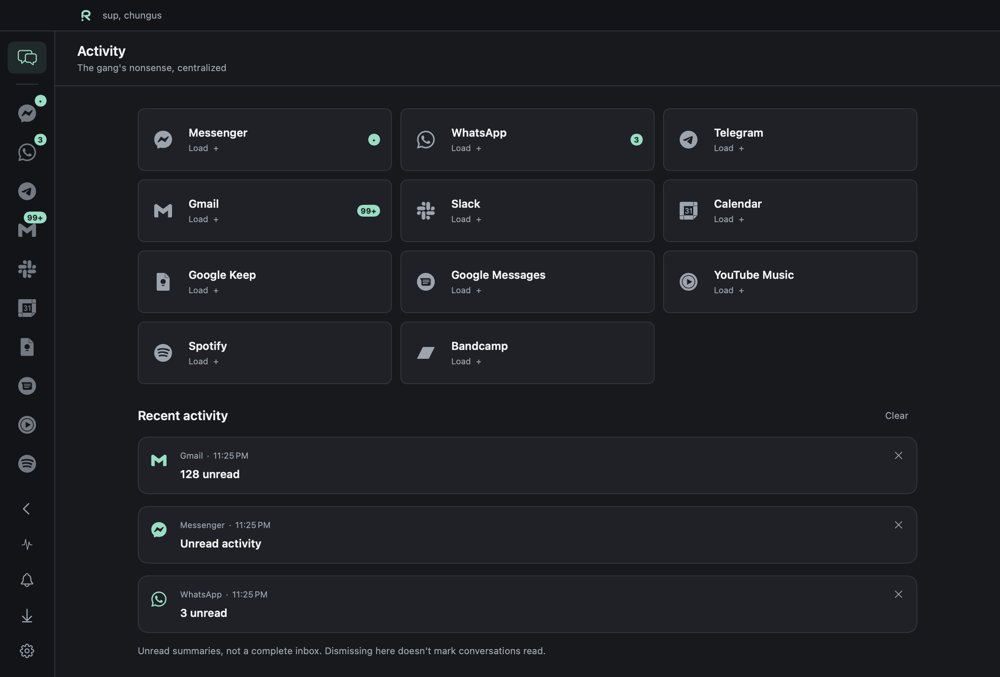

  
  <h1>Relay</h1>
  
<strong>Chats and music in one trench coat.</strong> Your daily tab circus, now with a home. For Windows and macOS.

  
<a href="https://github.com/chungus-actual/relay-releases/releases/latest"><strong>Download Relay</strong></a>

*Relay on macOS, with demo activity.*

Messenger, WhatsApp, Telegram, Gmail, Slack, Discord, Google Calendar, Keep, and Messages. Plus YouTube, Spotify, YouTube Music, and Bandcamp for moral support.

- **Work you. Home you.** Multiple accounts with separate sign-ins.
- **Less noise.** Unread badges, recent activity, and per-account mute controls.
- **Make room for four.** Open up to four services, pick a layout, and drag dividers to resize. Relay remembers your workspace.
- **Keep the music going.** Playback controls stay handy while you switch services.
- **Make yourself at home.** Rearrange shortcuts, pick a theme, and choose a companion: Puke the cat, Roof the dog, or Rock the rock.

### Get comfy

Grab your copy from the [latest release](https://github.com/chungus-actual/relay-releases/releases/latest). Expand **Assets** for the downloads:

| Platform | Download | Installation |
| --- | --- | --- |
| Windows · x64 | `Relay-<version>-Setup-x64.exe` | Run the installer. |
| Windows · x64 · portable | `Relay-<version>-win-x64.zip` | Extract the ZIP, then open `Relay.exe`. |
| macOS · macOS 14+ | `Relay-<build>.zip` | Unzip and move `Relay.app` to Applications. |

Windows packages are unsigned. The Mac app is signed and notarized. Relay 0.6.7 includes both Apple silicon and Intel support; future Mac releases will target Apple silicon. Intel users can keep downloading [0.6.7](https://github.com/chungus-actual/relay-releases/releases/tag/v0.6.7).

Choose a Windows or macOS package to install Relay; GitHub's automatic **Source code** archives are not installable apps.

No Relay account. No Relay server. No telemetry. Your services still play by their own rules.

Made for friends. No shareholders consulted.

[Getting started](docs/usage.md) · [Updates and checksums](docs/updates.md) · [Security](SECURITY.md) · [Credits](THIRD-PARTY-NOTICES.md) · [Release history](https://github.com/chungus-actual/relay-releases/releases)
