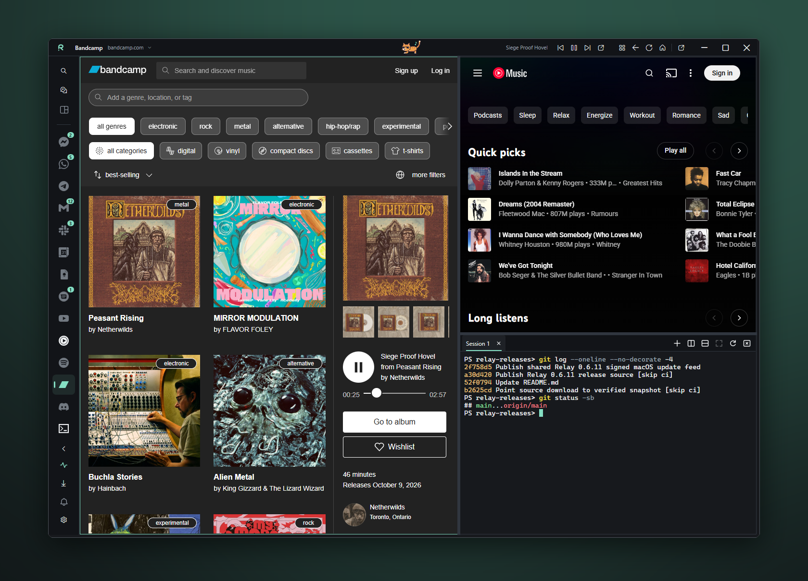
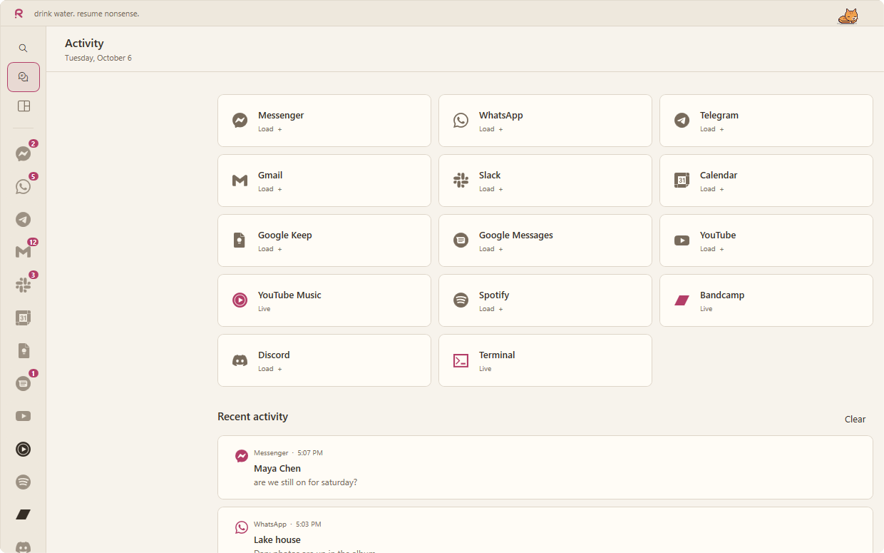
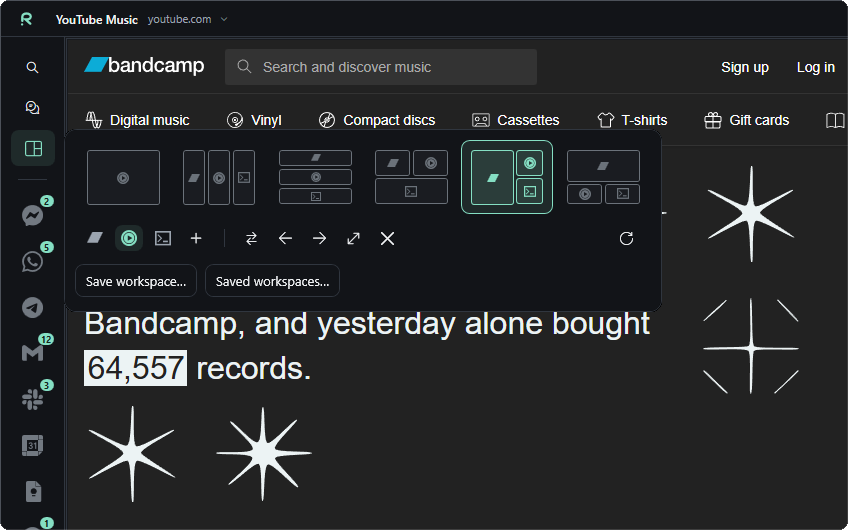
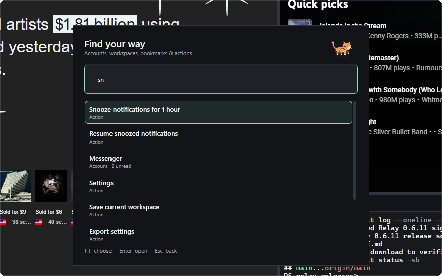
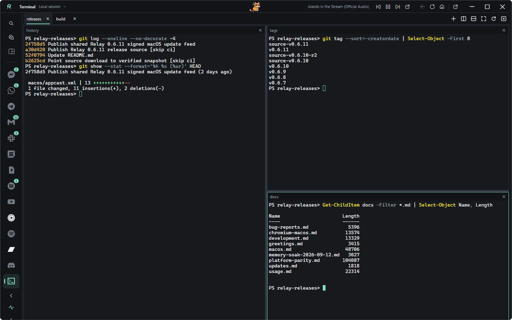
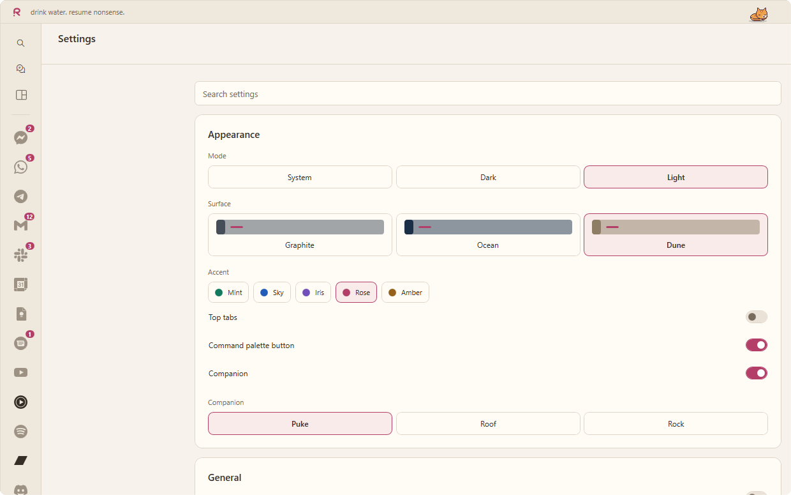
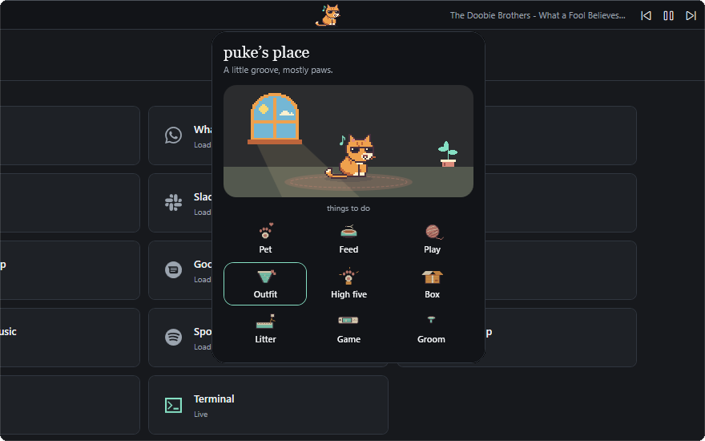

  
  <h1>Relay</h1>
  
<strong>Chats, mail and music in one window.</strong> For Windows and macOS.

  
<a href="https://github.com/chungus-actual/relay-releases/releases/latest"><strong>Download Relay</strong></a>

Relay runs the web versions of Messenger, WhatsApp, Telegram, Gmail, Slack, Discord, Google Calendar, Keep and Messages, plus YouTube, YouTube Music, Spotify, Bandcamp and a terminal. Each one keeps its own sign-in. Relay adds what a row of browser tabs doesn't have: one place for unread counts, side-by-side layouts, and playback controls that follow whatever is playing.

<table>
<tr>
<td width="50%"> <b>Activity.</b> Unread counts and recent notifications from every service.</td>
<td width="50%"> <b>Layouts.</b> Up to four services at once. Drag the dividers and save the arrangement.</td>
</tr>
<tr>
<td> <b>Command palette.</b> Jump to any account, workspace, bookmark or action.</td>
<td> <b>Terminal.</b> Tabs and splits, next to everything else.</td>
</tr>
<tr>
<td> <b>Themes.</b> Light or dark, three surfaces, five accents.</td>
<td> <b>Companion.</b> An optional cat, dog or rock in the title bar.</td>
</tr>
</table>

Screenshots are from Windows with a fresh profile. Unread counts and messages are demo data.

## What it does

- **Unread in one place.** Each service shows a badge, and Activity lists recent notifications. Dismissing one in Relay doesn't mark it read on the site.
- **More than one account.** Add a second Gmail or WhatsApp with its own sign-in, cookies, zoom, notifications and audio.
- **Layouts.** Side by side, stacked, a grid, or one large pane with the rest beside it. Relay remembers the arrangement, and you can save named workspaces.
- **Playback controls.** Play, pause and skip YouTube, YouTube Music, Spotify and Bandcamp from the title bar, whichever service you're looking at. Videos can float above other windows, and on Windows the taskbar thumbnail has the same buttons.
- **Command palette.** Ctrl+K (Cmd+K on a Mac) finds accounts, workspaces, bookmarks and actions.
- **Terminal.** PowerShell on Windows and your login shell on macOS, with tabs and up to four splits per tab.
- **Quiet when you need it.** Mute notifications, or snooze them for 30 minutes, an hour, eight hours or until 9 tomorrow, for everything or one account.
- **Downloads.** Files from every service land in one searchable list.
- **Settings that travel.** Export your accounts, layouts and bookmarks to a file and import it on either platform. Sign-ins aren't included.

## Download

Get the [latest release](https://github.com/chungus-actual/relay-releases/releases/latest).

| | Windows | macOS |
| --- | --- | --- |
| Download | Installer or portable ZIP | ZIP |
| Needs | 64-bit Windows with the [WebView2 Runtime](https://developer.microsoft.com/microsoft-edge/webview2/) | macOS 14 or later on Apple silicon |
| Signing | Not code-signed. Each release lists SHA-256 checksums | Developer ID signed and notarized |

Relay updates itself from this repository's releases and never installs an update until you say so. The last release for Intel Macs is the [0.6.7 universal build](https://github.com/chungus-actual/relay-releases/releases/tag/v0.6.7).

## Privacy

There's no Relay account, server or telemetry. Each service is the real website, running in its own browser profile on your computer, so your sign-ins and messages stay between you and that service. Bug reports are saved as a file for you to review and send yourself. More in [Security](SECURITY.md).

## Source

This repository has the Windows and macOS source for every release. Each `source-v<VERSION>` tag is a release snapshot, and `.release-source.json` records its original commit and file hashes. To build it, see [Development](docs/development.md).

[Download the 0.6.11 source](https://github.com/chungus-actual/relay-releases/archive/refs/tags/source-v0.6.11.zip). Release tags point to their matching public source snapshot.

[Controls](docs/usage.md) · [macOS](docs/macos.md) · [Development](docs/development.md) · [Security](SECURITY.md) · [Credits](THIRD-PARTY-NOTICES.md)
