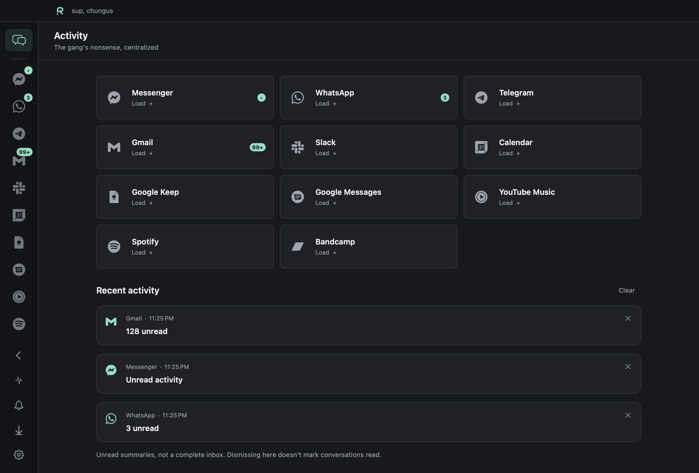

  
  <h1>Relay</h1>
  
<strong>Chats and music in one trench coat.</strong> Your daily tab circus, now with a home. For Windows and macOS.

  
<a href="https://github.com/chungus-actual/relay-releases/releases/latest"><strong>Download Relay</strong></a>

*Relay on macOS, with demo activity.*

Messenger, WhatsApp, Telegram, Gmail, Slack, Discord, Google Calendar, Keep, and Messages. Plus YouTube, Spotify, YouTube Music, and Bandcamp for moral support.

- **Work you. Home you.** Multiple accounts with separate sign-ins.
- **Less noise.** Unread badges, recent activity, and per-account mute controls.
- **Make room for four.** Open up to four services, pick a layout, and drag dividers to resize. Relay remembers your workspace.
- **Keep the music going.** Playback controls stay handy while you switch services.
- **Make yourself at home.** Rearrange shortcuts, pick a theme, and collect downloads in one place.

### Get comfy

Grab your copy from the [latest release](https://github.com/chungus-actual/relay-releases/releases/latest):

| Windows · x64 | macOS · Apple silicon |
| --- | --- |
| Unsigned installer or portable ZIP | Notarized ZIP · macOS 14+ |

Both platforms are listed under **Releases → Assets**.

Intel Macs can keep using the [0.6.7 universal download](https://github.com/chungus-actual/relay-releases/releases/tag/v0.6.7).

No Relay account. No Relay server. No telemetry. Your services still play by their own rules.

Made for friends. No shareholders consulted.

[Controls](docs/usage.md) · [macOS](docs/macos.md) · [Development](docs/development.md) · [Security](SECURITY.md) · [Credits](THIRD-PARTY-NOTICES.md)

## Release source

The [public repository](https://github.com/chungus-actual/relay-releases) includes released Windows and macOS source, assets, tests, and build scripts. Each `source-v<VERSION>` tag pins a release snapshot; `.release-source.json` records its original commit and file hashes. Build instructions are in [Development](docs/development.md).

[Download the 0.6.10 source](https://github.com/chungus-actual/relay-releases/archive/refs/tags/source-v0.6.10-r2.zip). The earlier 0.6.10 release tag is preserved; use this source tag for its application code. Future release tags point to their matching public source snapshot.
